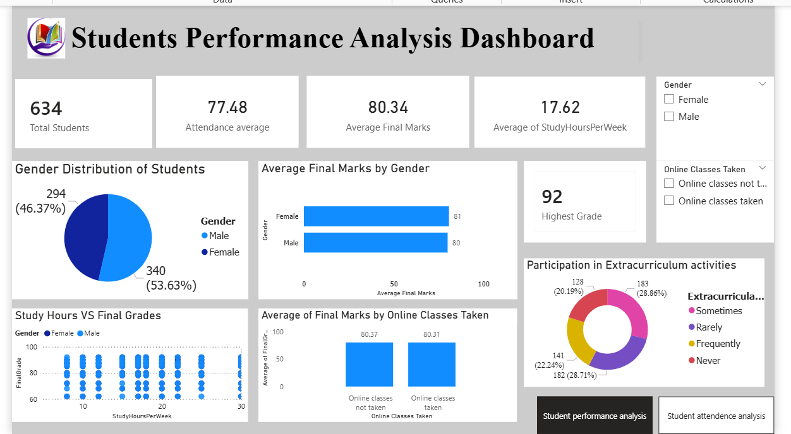
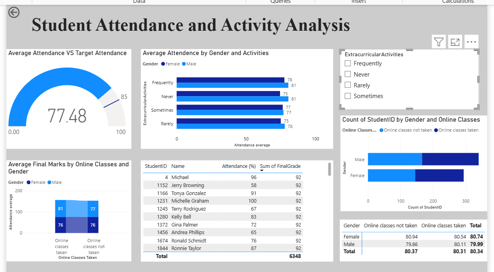

# Student-Performance-Power-BI-Dashboard
Interactive Power BI dashboard for analyzing student performance and attendance.
📌 Overview
This project focuses on Student Performance Analysis using Power BI dashboards. The goal is to transform raw student data into meaningful insights that help educators understand academic performance and support better decision-making.
📂 Repository Contents
📂 Repository Contents
📊 **Student Performance Dashboard.pbix** → Power BI Dashboard File 📄 **Student_Performance.csv** → Raw Dataset 🖼️ **Dashboard_Page1.png** → Dashboard Preview 🖼️ **Dashboard_Page2.png** → Insights Dashboard 📘 **README.md** → Project Documentation
🎯 Project Objectives
* Analyze student grade distributions and academic trends.
* Track demographic and behavioral factors affecting performance.
* Evaluate subject-wise metrics and passing rates.
* Build an interactive, filterable interface for educators and administrators.
🛠️ Tools & Technologies
* **Power BI** (Data Modeling, DAX, & Visualization)
* **Power Query** (Data Extraction and Transformation)
* **Data Visualizations** (Bar charts, KPI cards, matrix tables)
💡Data Analysis & Business Intelligence
📊 Dashboard Highlights
* **Performance Tracking:** Quick overview of average scores, overall passing rates, and student rankings.
* **Demographic Breakdown:** Insights into how external variables correlate with academic achievement.
* **Subject Analysis:** Deep-dive filters to look at specific classes, terms, or test categories.
* **Linguistic & Semantic Mapping:** Integrated basic natural language schemas for intuitive data querying.
🖼️ Dashboard Preview
*### Page 1: Overview Dashboard

#### Page 2: Insights Dashboard

🚀 Key Insights
* **Trend Identification:** Pinpointed foundational subjects where students consistently require extra tutoring.
* **Metric Cohesion:** Leveraged an interconnected data model (`DataModel`) to allow dynamic cross-filtering between demographics and grades.
* **Actionable KPI Layouts:** Designed a clean, user-friendly canvas ensuring key performance indicators stand out immediately.
🔮 Future Improvements
* 🔌 Connect a live school database or Student Information System (SIS) via SQL/API.
* 🤖 Integrate predictive analytics to flag students likely to need academic intervention early in the semester.
* 🔄 Automate scheduled data refreshes for real-time grade tracking.
👤 Author
**Sara Fatima**
* 💼 Data Analytics Enthusiast | Power BI Developer
⭐ Support
If you like this project, feel free to support it by:
* ⭐ Giving a star to the repository!
* 🍴 Forking it for your own learning.
* 📢 Sharing it with others.
